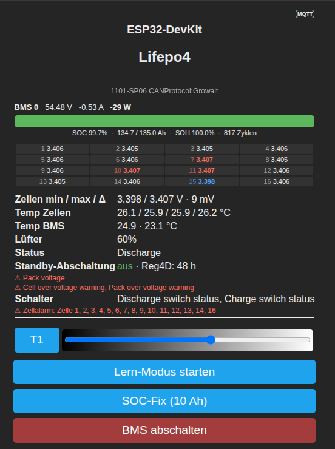

# tasmota-seplos-driver

Berry-Treiber für Tasmota (ESP32), der ein oder mehrere **Seplos BMS** (EMU10XX/11XX, z.B. 1101-SP06, „Polo"/„Mason"-Kits, 8–16S LiFePO4) über **RS485** ausliest und die Daten per **MQTT** und auf der **Tasmota-Weboberfläche** bereitstellt.

Basiert auf der originalen Seplos-Dokumentation *SEPLOS BMS Communication Protocol V2.0* (MODBUS-ASCII nach YD/T1363.3) sowie den Protokoll-XMLs (`Agreement`-Ordner) der Seplos BatteryMonitor-Software.



## Features

- **Telemetrie (42H)**: Zellspannungen, Temperaturen, Strom (vorzeichenbehaftet), Packspannung, SOC, SOH, Kapazitäten, Zyklen, Portspannung
- **Alarme & Status (44H)**: alle Warnungen/Schutzabschaltungen, Systemstatus (Charge/Discharge/Standby), Schalterzustände, Balancing- und Zelltrennungs-Status
- **Geräteinfo (51H)**: Modell und CAN-Protokoll, als Überschrift auf der Weboberfläche
- **Settings-Monitor (47H)**: liest stündlich den Parameterblock und zeigt an, ob die **Standby-Abschaltung** (48h-Shutdown) aktiv ist inkl. Register 4D (Delay/Countdown)
- **Multi-Pack**: mehrere BMS am selben Bus über `self.packs = ["00", "01", ...]` — **Hinweis: bisher nur mit einem Pack getestet**, Feedback willkommen
- **Lern-Modus**: passives Mitschneiden des kompletten Bus-Verkehrs (z.B. parallel zur original BatteryMonitor-Software) zum Analysieren unbekannter Kommandos — Web-Button oder Konsole `SeplosLearn 1` / `SeplosLearn 0`
- **Web-Buttons**: BMS-Shutdown (mit Sicherheitsabfrage) und SOC-Fix
- **Lüfterregelung**: temperaturgeführter PWM-Lüfter über Tasmota `Dimmer` (Pack 0)
- **SOC-Fix bei Tiefentladung**: setzt das SOC-Register neu, wenn die Packspannung unter 40 V fällt — nur ohne große Entladelast (Spannungseinbruch-Schutz), mit 60-Minuten-Sperre
- **Robuster Empfang**: LENGTH- und CHKSUM-Validierung aller Frames, tolerant gegen Störzeichen und parallel pollende Master (z.B. PC-Software am selben Bus)

## Hardware

- 1× [ESP32 Dev Board](http://www.amazon.de/dp/B071P98VTG/)
- 1× [TTL-zu-RS485-Adapter (UART Level Converter, 3.3V/5V)](https://www.amazon.de/dp/B07DJ4TGY3/)

Verdrahtung (Standard im Skript, anpassbar in der Zeile `static ser = serial(17, 16, 19200, ...)`):

| ESP32 | RS485-Modul |
|-------|-------------|
| GPIO17 (RX) | RO |
| GPIO16 (TX) | DI |
| 3V3 / GND | VCC / GND |
| | A/B → BMS RS485 |

BMS-Schnittstelle: 19200 Baud, 8N1 (Werkseinstellung der EMU11XX-Serie ggf. 9600 — im Skript anpassen, falls keine Antwort kommt).

## Installation

1. Tasmota32 auf dem ESP32 installieren
2. `rs485.be` über *Consoles → Manage File system* hochladen
3. In `autoexec.be` laden: `load("rs485.be")` (oder Datei als `autoexec.be` ablegen)
4. Neustart — in der Berry-Konsole erscheint `SEPLOS Treiber geladen (v0.5)`

## Konfiguration

Alles im `init()` des Skripts:

| Variable | Standard | Bedeutung |
|----------|----------|-----------|
| `self.packs` | `["00"]` | BMS-Adressen (DIP-Schalter), z.B. `["00", "01"]` für zwei Packs |
| `self.fanTemp` | `26.5` | Lüfter-Einschalttemperatur (°C), Regelung über `Dimmer` |
| `self.socFixMaxLoad` | `5.0` | max. Entladestrom (A), bei dem der SOC-Fix noch auslösen darf |

Abfragezyklen: Telemetrie alle 15 s, Alarme alle 30 s, Settings stündlich (jeweils pro Pack rotierend).

## MQTT

Die Daten hängen am regulären Tasmota-`SENSOR`-Telegramm unter dem Key `seplos`, gegliedert nach Pack-Adresse:

```json
"seplos": {
  "0": {
    "Voltage": 53.16, "Current": -0.95, "SOC": 62.2, "SOH": 100,
    "RemainingCapacity": 77.2, "BatteryCapacity": 124.1, "CycleLife": 817,
    "Cells": {"0": 3323, "min": 3322, "max": 3324, "diff": 2, "count": 16},
    "Temperatures": {"0": 24.2, "count": 6},
    "SystemStatus": "Charge",
    "Warnings": {"Power Status": "...", "CellEqualization": ""},
    "Settings": {"StandbyShutdownFunction": 0, "StandbyShutdownDelay": 48, "SwitchShutdownFunction": 0, "FunctionByte7": "0C"},
    "DeviceInfo": "1101-SP06 CANProtocol:Growalt"
  }
}
```

## Sicherheitshinweise

- **BMS-Shutdown ist eine Einbahnstraße**: Aufwecken geht nur am Gerät (Reset-Taste ~3 s), durch Anlegen von Ladespannung (>48 V) oder Batterie ab-/anklemmen — **nicht** per RS485.
- **Vorsicht mit „Switch shut down function"** in der BatteryMonitor-Software: Ist sie aktiv und kein externer Schalter angeschlossen, schaltet das BMS direkt nach dem Start wieder ab. Rettung: Ladespannung anlegen, dann Funktion per Software deaktivieren.
- Einzelne Parameter lassen sich bei dieser Firmware nicht per 49H schreiben („command not supported") — Einstellungen gehen nur als kompletter Block über A1H („Set all" der PC-Software). Das SOC-Register (0x3B) ist die Ausnahme.

## Protokoll-Referenz

Die vollständige Register-Tabelle (Telecontrol-Bits, alle 47H/49H-Parameter-Register inkl. Einheiten/Skalierung, Funktions-Schalter-Bits) steht in [`docs/seplos_register.md`](docs/seplos_register.md) — extrahiert aus den Protokoll-XMLs der BatteryMonitor V2.1.8.

## Changelog

- **v0.5** — Multi-Pack-Adressrotation (ungetestet), Geräteinfo (51H), Settings-/Standby-Monitor (47H) mit Retry, Lern-Modus, Shutdown-/SOC-Buttons mit Bestätigung, CHKSUM-/LENGTH-Validierung beim Empfang, korrekte LCHKSUM-Berechnung (Nibble-Summe), Adress-Bug im Alarm-Parser gefixt, SOC-Fix nur ohne Last, 100-ms-Empfangstakt (keine Pufferüberläufe bei langen Frames), überarbeitete Weboberfläche (SOC-Balken, Zellen-Gitter, Warnungen nur bei Bedarf)
- v0.2 — Alarm-Parsing, Lüfterregelung, SOC-Fix
- v0.1 — Erste Version (Telemetrie, MQTT)

## Links

- Diskussion: [Akkudoktor-Forum](https://forum.drbacke.de/viewtopic.php?t=5454)
- Verwandte Projekte: [syssi/esphome-seplos-bms](https://github.com/syssi/esphome-seplos-bms), [ichernev/seplos-bms-tool](https://github.com/ichernev/seplos-bms-tool), [KlausLi/Esp-Seplos-Controller](https://github.com/KlausLi/Esp-Seplos-Controller)
